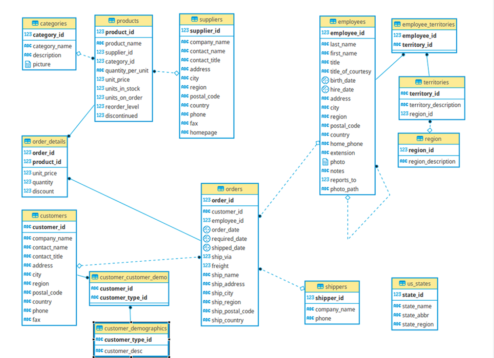

# PostgreSQL_Northwind
To practice PostgreSQL, I used the Northwind dataset which is a dataset of a small fictional company. It includes customer information, shipping info, product info, orders, and more. I created questions that may be relevant for a business and for analytics. These are NOT the only important questions that may be asked but a few of a many! 

I attached the queries to answer the questions below and the excel file with each query output inside the DATA OUTPUT folder. 

  

# Questions for analysis 
#### 1. What products did the customer buy? What was his/her name and how much of each product did he/she buy? On what day? 

#### 2. Who are the best employees in terms of number of sales (NOT revenue)? What are his/her title and hire date? Is there any correlation between the hire date/title with the number of sales? 

#### 3. How many months of sales/orders are recorded in this database? What is the first and last day of orders recorded? 

#### 4. a) For each order, how much revenue did Northwind make and which employee was in charge of that order? b) What is the total revenue each employee make and which employee is the best in terms of revenue (NOT the same as question 2)? 

#### 5. What regions/areas are the products being shipped to? 

#### 6. What are the most popular products and least? 

#### 7. Which customer had the most purchases and where is he/she from? 

#### 8. What is the discount distribution?

#### 9.a) What days had the most and least amount of sales in terms of order numbers? b) Which days had the most and least amount of sales in terms of revenue? 

   
